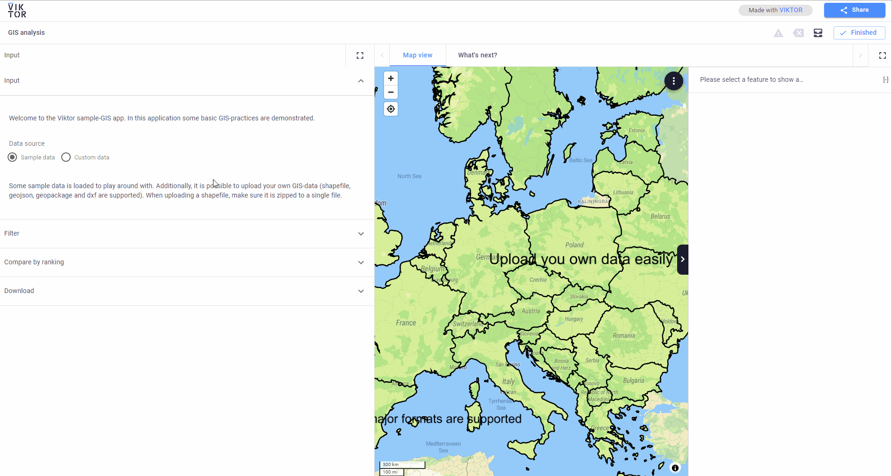
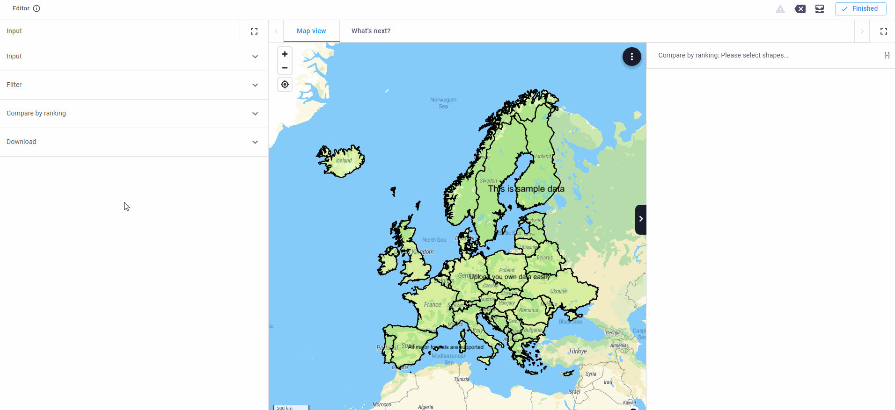
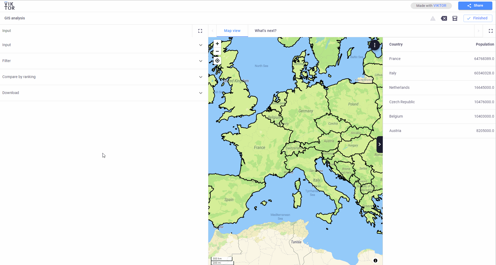

 <Please check version is the same as specified in requirements.txt>

# GIS analysis in Viktor
This sample app demonstrates how to do a GIS-analysis in Viktor.

The goal of this app is to demonstrate some common GIS analyses using Viktor. This app was developed using an 
open-source library (`geopandas`), which provides a powerful toolkit for GIS-analysis. Using Viktor, complex analysis 
becomes easy to perform, accessible through the browser.

In this application the following functionalities are demonstrated:
- Uploading and visualizing custom GIS-data (shapefile, geopackage, geojson)
- Add filters to attribute table
- MapView interaction, analysis on selected features
- Download data as any GIS-datatype (shapefile, geopackage, geojson, autocad)

A published version of this app is available on [demo.viktor.ai](https://demo.viktor.ai/public/gis-analysis).

### Step 1: Upload GIS-data
Easily upload your own GIS-data. All major data-types are supported, such as shapefile, geopackage and geojson.
When uploading a shapefile, make sure it is zipped into a single file.

Some sample data it pre-loaded to play around with by default, so it is possible to skip this step.

### Step 2: Set filter

Set a filter on the attribute data. First choose a field name. The field names are automatically imported from the 
attribute table. Then, choose a filter type. Two options are available, unique and range.
- Unique values: all unique values from the selected field name are imported
- Range: Set a minimum and maximum value to filter numerical values

Activate the "set filter" toggle to apply the filter and only visualize the geometry on the map, which is within the 
filter.

### Step 3: Compare attributes

Within Viktor it is also possible to interact with the map, which is demonstrated here. First select a field name and a
 value to compare with. Then, click on "Select features to compare". The user is asked to select features on the map to 
compare. When the selection is finished, the results are shown in the data tab on the right-hand side and are ranked 
from high to low.

### Step 4: Download file

Finally it is possible to export the features to different types of GIS-datatypes:

- Shapefile
- Geopackage
- AutoCAD
- GeoJSON

Additionally, it is possible to project the features to any coordinate system (ESPG).

## App structure
This is an editor-only app type.
